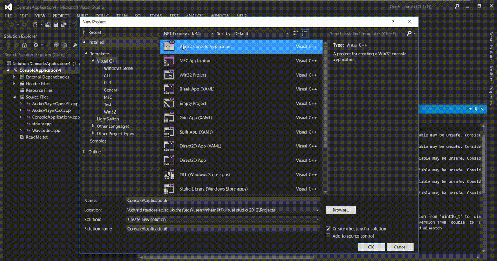
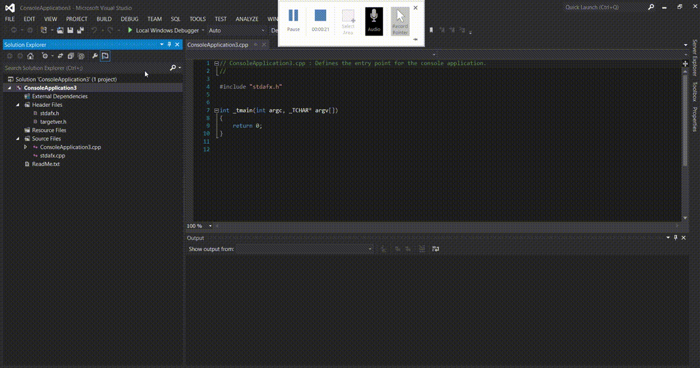
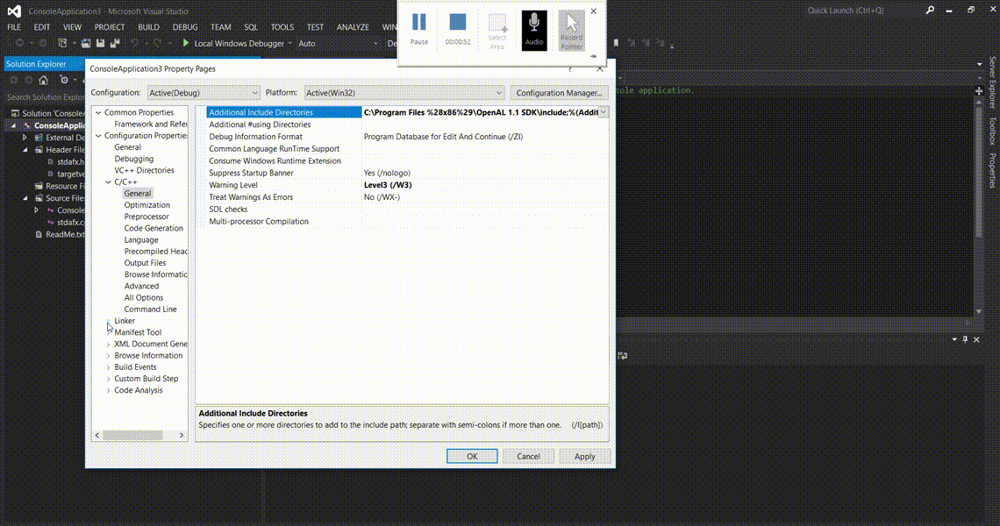
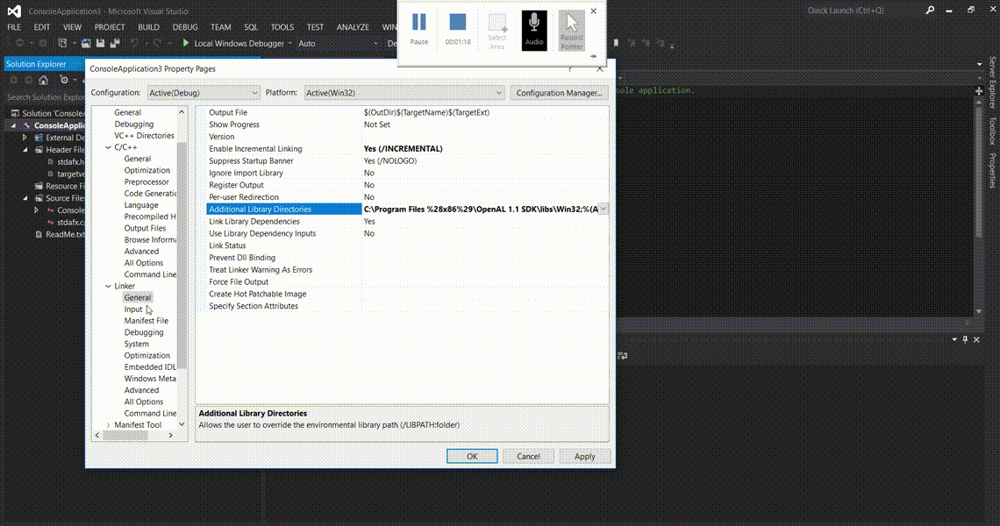
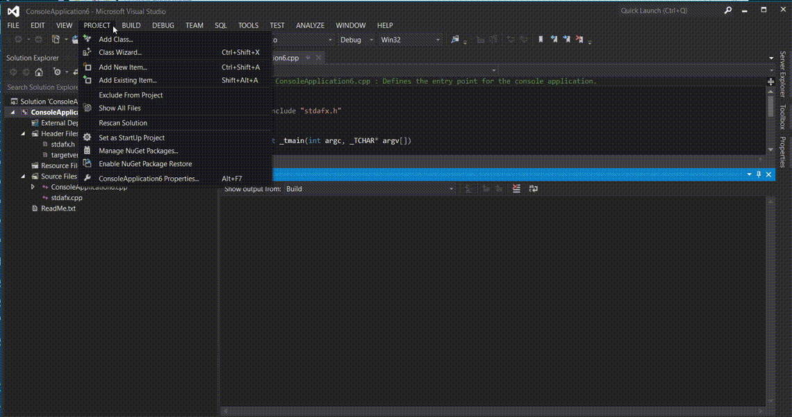
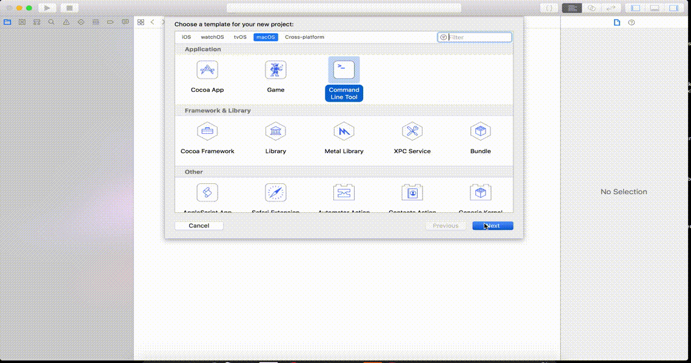
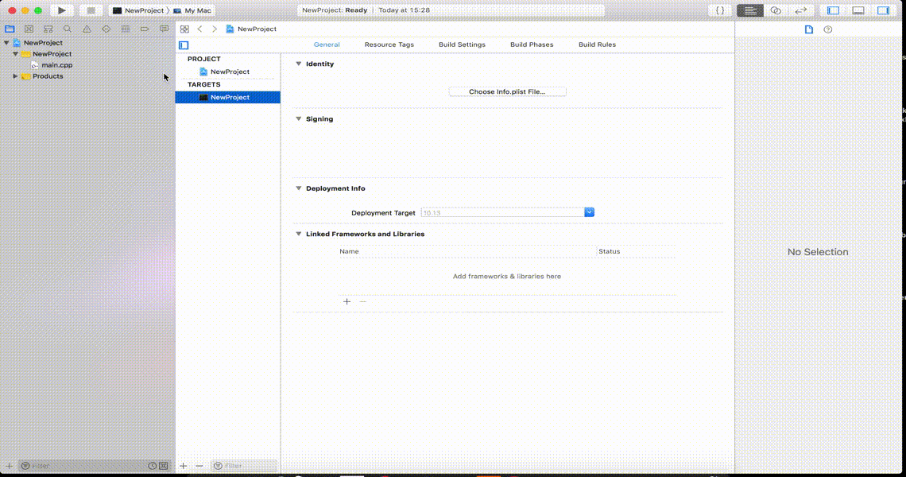
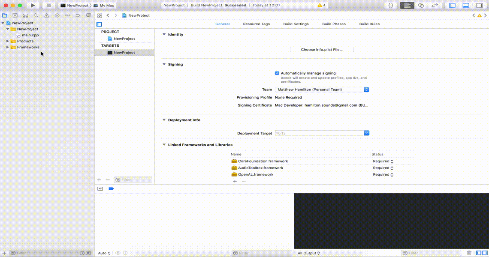

Since there is no standard audio library for C++, we will need to add an external library in order to play audio from the command line. In this case we will be using OpenAL.

OpenAL is an SDK primarily for Game Audio and simple acoustics modelling. However, it can be used to just play a `wav` file or indeed an array of type `float`. Instructions for installation and setup are given below

### Visual Studio

[Download the OpenAL SDK](https://www.openal.org/downloads/)

- **Create a new console project**

- **Add includes folder for headers**

- **Add OpenAl library in linker**

- **Add `OpenAL32.lib` to linker input**

You should now be able to include the `<al.h>` and `<alc.h>` headers

- **Add Existing Files**

Now press <kbd>F7</kbd> to build

### Xcode

- **Create a new project**

- **Add OpenAL framework to target**

- **Add Existing Files**

Now press <kbd>⌘</kbd> + <kbd>B</kbd> to build

## TroubleShooting

`linker command failed with exit code 1 (use -v to see invocation)
`

**What does this mean?**

- This typically means you have included a header but not the framework or the `cpp` file. Have a look at your project again and make sure you have included all the required files and frameworks.
