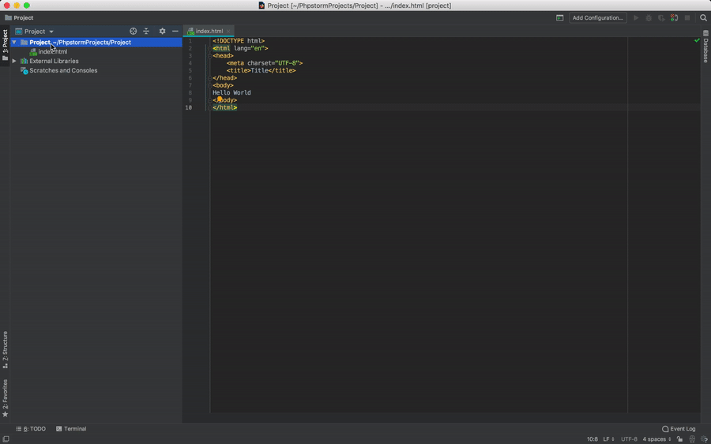

An easy way to edit your site directly on the cPanel server is to connect via SSH File Transfer Protocol (SFTP)

***

### Create A New Project

***

### Set SFTP Server

- Go to Preferences (or Settings)
    - <i class="fab fa-apple"></i>: <kbd>⌘</kbd> + <kbd>,</kbd>
    - <i class="fab fa-windows"></i>: <kbd>Ctrl</kbd> + <kbd>Alt</kbd> + <kbd>S</kbd>

- `Build, Execution, Deployment` -> `Deployment`
- Click the **+** icon to add a server. Name it `cPanel`

    Enter these details

    | Type           | SFTP                    |
    | -------------- | ----------------------- |
    | Host           | **your_domain**† |
    | port           | `22`                 |
    | User Name      | **Cpanel_Username***                 |
    | Authentication | Password                |
    | Root Path      | /                |

**†** the domain you have chosen -  eg: example.co.uk

**\*** the username used to log into cpanel

***

### Map a Folder

- Still in `Build, Execution, Deployment` -> `Deployment`, go to Mappings tab
- Click folder in deployment path
- Navigate to /home/**cpanel_username**/public_html/ and click <kbd>OK</kbd>

***

### Upload to server

Create a new file in PHPStorm. You can now upload this file with the server

#### Manual Upload

To upload files manually:
- Right click the project folder
- `Deployment` -> `Upload to cPanel`

#### Automatic Upload

You can also set the project to automatically upload every time you save.

- In `Build, Execution, Deployment` -> `Deployment`
- Click the disclosure triangle and select `Options`
- For `Upload changed files automatically to the default server` select `on explicit action`

