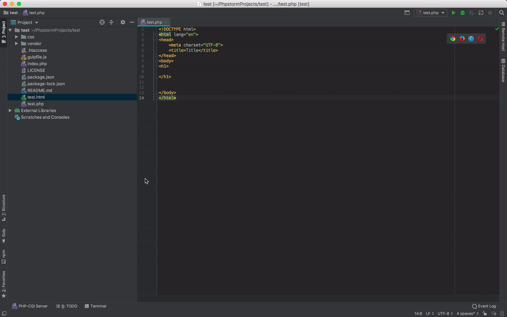

Sometimes it's nice to test out ideas on your own or just as a means of [Staging](https://en.wikipedia.org/wiki/Deployment_environment#Staging) before uploading to your web server. Here are a few ways you can run php locally to do some debugging.

## PHP REPL

If you are running macOS then you can run a local PHP REPL (Read, Evaluate, Print, Loop) in the Terminal with this command. If you are on windows or linux, you will need to install PHP (see below)

```
php -a
```

You can now type in individual lines of PHP code to see if they work, a great tool for debugging. Try

```php
echo 'Hello, World!';
echo 1 + 1;
```

You can also run php scripts with:

```php
require_once('PATH/TO/FILENAME.php')
```

## Installing PHP

<div class="row">
  <div class="col-md-4">
    <h4 id="php-windows"><i class="fab fa-windows"></i> Windows</h4>
    <!-- <a href="https://www.youtube.com/watch?v=339AEqk9c-8">Video Tutorial</a> -->
    <ol>
      <li>
        <strong> <a href="https://www.apachefriends.org/index.html" rel="nofollow">Open the XAMPP website.</a></strong>
      </li>
      <li>
        <strong>Click <strong>XAMPP for Windows</strong>.</strong>
      </li>
      <li>
        <strong>Double-click the downloaded file.</strong>
      </li>
      <li>
        <strong>Click <strong>Yes</strong> when prompted.</strong> This will open the XAMPP setup window.
      </li>
      <li>
        <strong>Click <strong>Next</strong>.</strong> until install location option.
      </li>
      <li>
        <strong>Select an installation location.</strong> Click the folder-shaped icon to the right of the current installation destination, then click a folder on your computer.
        <ul>
          <li>If you have the
            <a href="https://docs.microsoft.com/en-us/windows/security/identity-protection/user-account-control/how-user-account-control-works">
              UAC
            </a>
            activated on your computer, avoid installing XAMPP in your hard drive's folder (e.g., <strong>OS (C:)</strong>).
          </li>
          <li>
            You can select a folder (e.g., <strong>Desktop</strong>) and then click <strong>Make New Folder</strong> to create a new folder and select it as the installation destination.
          </li>
        </ul>
      </li>
      <li>
        <strong>Click <strong>OK</strong>.</strong>
      </li>
      <li>
        <strong>Click <strong>Next</strong>.</strong>
      </li>
      <li>
        <strong>Uncheck the "Learn more about Bitnami" box, then click <strong>Next</strong>.</strong>
      </li>
      <li>
        <strong>Begin installing XAMPP.</strong> Click <strong>Next</strong>
      </li>
      <li>
        <strong>Click <strong>Finish</strong> when prompted.</strong>
      </li>
      <li>
        <strong>Select a language.</strong>
      </li>
      <li>
        <strong>Click <strong>Save</strong>.</strong> Doing so opens the main Control Panel page.
      </li>
      <li>
        <strong>Start XAMPP from its installation point.</strong> If you need to open the XAMPP Control Panel in the future, you can do so by opening the folder in which you installed XAMPP, right-clicking the orange-and-white
        <strong>xampp-control</strong> icon, clicking <strong>Run as administrator</strong>, and clicking <strong>Yes</strong> when prompted.
        <ul>
          <li>When you do this, you'll see red <strong>X</strong> marks to the left of each server type (e.g., "Apache"). Clicking one of these will prompt you to click <strong>Yes</strong> if you want to install the server type's software on your
            computer.</li>
          <li>Counterintuitively, double-clicking the <strong>xampp_start</strong> icon doesn't start XAMPP.</li>
        </ul>
      </li>
      <li>
        <strong>Resolve issues with Apache refusing to run.</strong> On some Windows 10 computers, Apache won't run due to a "blocked port". This can happen for a couple of reasons, but there's a relatively
        <a href="https://pureinfotech.com/install-xampp-windows-10/">easy fix</a>
        <ul>
          <li>Click <strong>Config</strong> to the right of the "Apache" heading.</li>
          <li>Click <strong>Apache (httpd.conf)</strong> in the menu.</li>
          <li>Scroll down to the "Listen 80" section (you can press <kbd>Ctrl</kbd>+<kbd>F</kbd> and type in <kbd>listen 80</kbd> to find it faster).</li>
          <li>Replace <kbd>80</kbd> with any open port (e.g., <kbd>81</kbd> or <kbd>9080</kbd>).</li>
          <li>Press <kbd>Ctrl</kbd>+<kbd>S</kbd> to save the changes, then exit the text editor.</li>
          <li>Restart XAMPP by clicking <strong>Quit</strong> and then re-opening it in administrator mode from its folder.</li>
        </ul>
      </li>
    </ol>
  </div>
  <div class="col-md-4">
    <h4 id="php-macosx"><i class="fab fa-apple"></i> macOS</h4>
    <p>
      macOS comes with a built-in version of PHP. However, in order to use it with PHPStorm you will need a different version. The easiest way will be to install MAMP
    </p>
    <p>
      To install MAMP:
    </p>
    <ol>
      <li>Open Terminal</li>
      <li>
        First install homebrew by pasting in:

/usr/bin/ruby -e "$(curl -fsSL https://raw.githubusercontent.com/Homebrew/install/master/install)"

      </li>
      <li>
        Then paste:

brew cask install mamp

      </li>
      <li>
      MAMP should now be in your `Applications` folder.
      </li>
    </ol>

  </div>
  <div class="col-md-4">
    <h4 id="php-linux"><i class="fab fa-linux"></i> Linux</h4>
    <p>
      In Terminal, paste-in

sudo apt-get install \
libapache2-mod-php7.0\
              php7.0 \
       php7.0-common \
         php7.0-curl \
          php7.0-dev \
           php7.0-gd \
            php-pear \
         php-imagick \
       php7.0-mcrypt \
        php7.0-mysql \
           php7.0-ps \
          php7.0-xsl

    </p>
  </div>

</div>  End of 'shell' section. 

## PHPStorm

Now you have PHP installed on your machine, you can run your php scripts and webpages in PHPStorm. Here is a step by step and see the GIF below.

1. Go to: `Preference` `>`  `Languages & Frameworks` `>` `PHP`
2. Click `...`
3. Click **+**
4. In `PHP Executable` double click the folder icon.
5. Navigate to your `XAMPP` or `MAMP` directory
6. Select `bin` `>` `php`
7. Select a php version
8. In the `bin` directory select `php-cgi`



You can now open your PHP page in a web browser as demonstrated below.


