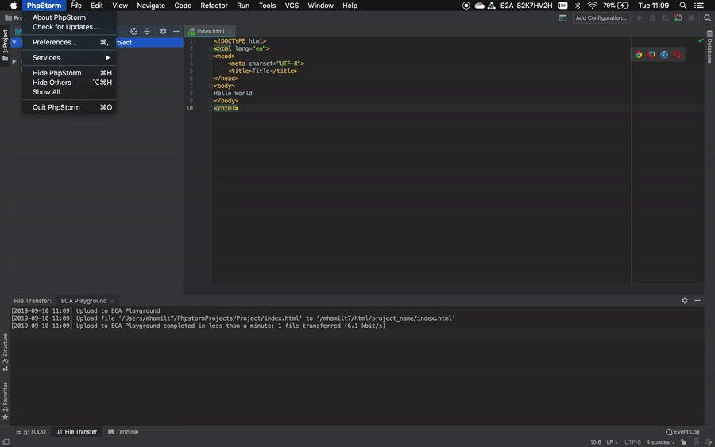

An easy way to edit your site directly on the [playgrounds server](https://www.wiki.ed.ac.uk/display/ECAIT/Experimental+web+server) is to connect via SSH File Transfer Protocol (SFTP)

***

### Create A New Project

***

### Set SFTP Server

- Go to Preferences
    - <i class="fab fa-apple"></i>: <kbd>⌘</kbd> + <kbd>,</kbd>
    - <i class="fab fa-windows"></i>: <kbd>^</kbd> + <kbd>,</kbd>

- `Build, Execution, Deployment` -> `Deployment`
- Add a server (<kbd>^</kbd> + <kbd>N</kbd>) or click the **+** icon. Name it `ECA Playground`

    Enter these details

    | Type           | SFTP                    |
    | -------------- | ----------------------- |
    | Host           | playground.eca.ed.ac.uk |
    | port           | `22222`                 |
    | User Name      | **UUN**                 |
    | Authentication | Password                |
    | Root Path      | /**UUN**                |

***

### Map a Folder

- Still in `Build, Execution, Deployment` -> `Deployment`, go to Mappings tab
- Click folder in deployment path
- Create a new directory in the `html` folder, give it the name of your project
- set Web Path to /~**UUN**/**PROJECT_NAME**

***

### Upload to server

Create a new file in PHPStorm. You can now upload this file with the server

#### Manual Upload

To upload files manually:
- Right click the project folder
- `Deployment` -> `Upload to ECA Playground`

#### Automatic Upload

You can also set the project to automatically upload every time you save.

- In `Build, Execution, Deployment` -> `Deployment`
- Click the disclosure triangle and select `Options`
- For `Upload changed files automatically to the default server` select `on explicit action`

